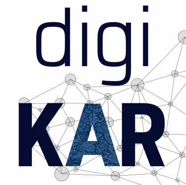

# User Stories und Competency Questions im DigiKAR-Projekt

Diese Website enthält die <a href="competency-questions/">User Stories and zugehörigen Competency Questions</a> des <a href="https://digikar.eu/">DigiKAR Projekts</a>. Diese ‚Fragen‘ behandeln Anforderungen verschiedener Nutzergruppen und sind die Grundlage für die Entwicklung der <a href="https://ieg-dhr.github.io/DigiKAR-Ontology-Design/">Ontology Design Patterns</a> für das Projekt.

<h2>Einführung in das Konzept der User Stories und Competency Questions</h2>

## Über DigiKAR
Die »Digitale Kartenwerkstatt Altes Reich – historische Räume neu modellieren und visualisieren« ist ein Kooperationsprojekt des Leibniz-Instituts für Europäische Geschichte Mainz (IEG), des Leibniz-Instituts für Länderkunde Leipzig (IfL), des Leibniz-Instituts für Ost- und Südosteuropaforschung Regensburg(IOS), der Johannes Gutenberg-Universität Mainz (JGU) und der École des Hautes Études en Sciences Sociales Paris, Frankreich (EHESS).

Das Projekt widmet sich Fragen der Fragmentierung, Verflechtung, Pluralität und Konkurrenz räumlicher Strukturen im frühneuzeitlichen Heiligen Römischen Reich deutscher Nation. Anhand zweier Fallstudien zu den Kurfürstentümern Mainz und Sachsen werden in der „digitalen Kartenwerkstatt“ alternative Ansätze für die Erfassung, Aufbereitung und Darstellung mehrdeutiger räumlicher Konfigurationen und Praktiken erarbeitet. DigiKAR möchte damit einerseits generell einen Beitrag zur geschichtswissenschaftlichen Erforschung des Alten Reichs als Raum geteilter und überlappender Herrschaft leisten. Andererseits sollen innovative und für andere Forschungsprojekte anschlussfähige Konzepte sowie „Best Practices“ der Sammlung, Modellierung und Visualisierung von ortsbezogenen historischen Daten entwickelt werden.

Das Vorhaben wird für den Zeitraum von drei Jahren durch das Programm »Leibniz-Kooperative Exzellenz« der Leibniz-Gemeinschaft gefördert.

<h2>Informationen zur Erstellung bzw. Benutzung von User Stories und Competency Questions für Nutzergruppen</h2>

<ul>
  <li>Historiker*innen (bzw. an inhaltlichen Datenauswertungen interessierte Personen)</li>
  <li>Archivar*innen (bzw. Personen und Institutionen, die Quellen bereitstellen und Metadaten vorhalten)</li>
  <li>Informationswissenschaftler*innen (mit Fokus auf Modellierung und Interoperabilität)</li>
  <li>IT-Expert*innen/Entwickler*innen (z.B. mit Blick auf Datenbankentwicklung und Erstellung komplexer Abfragen)</li>
</ul>
